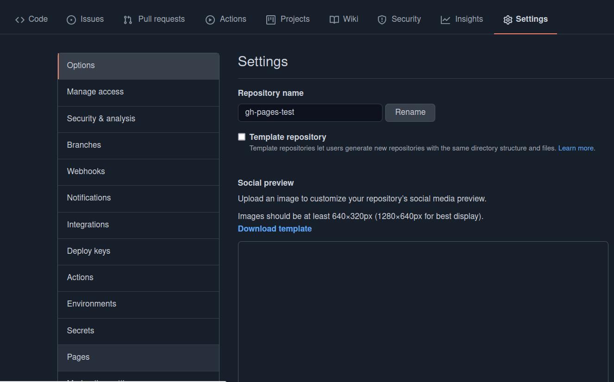

# Exercise 1: Publishing Workflow: Publish Two Exercises

Let's make our work public to share it with the world. Use this power wisely and **within legal laws & regulations** (no hate, no bullying, misinformation etc.).

Note: This was last updated in **July 2021**. At this time...
    
* ...the settings for github pages are located at: tab **settings** / sub menu **pages**. 
* ... Github's default branch name currently is `main`. This changed during time. If you want to publish older repositories, or use older versions of the command line tool you may need to rename the old `master`-branch with `git branch -m main` before following this guide. Or you can sipmly use master if you don't want any changes for now. (Yet, we'll call the main branch as `main` in this instruction)

## Idea

We will use Github's service Github pages to publish content of repositories to a publicly accessible URL in the shape of https://accountname.github.io/repositoryname/. 

There are some things you need to be aware of:

1. github pages by default translates markdown files (like README.MD) to HTML while using a program called [Jekyll](https://jekyllrb.com/). We want to write our own HTML/CSS, so we will disable this default behavior.
2. github pages only works for public repositories for basic accounts. (PRO accounts also can publish private repositories)


## Instructions

1. Create a repository on your own personal GitHub account(the same name as your local exercise folder name)
    * if you have a free github account, the repository needs to be **public** for this exercise.
2. initialize your local folder with `git init` & connect your remote repo locally to your maschine with `git remote add origin git@github.com:[account name][repo name]`.
3. make an initial commit by staging (`git add .` and `git commit -m "initial commit"`)
    * Push the `main` branch to github with `git push -u origin main` Refresh the GitHub webpage, now you'll see the repo updated
4. By default Github pages with a branch `gh-pages`
    * let's create such a branch as a copy of the current (`main`) by typing `git checkout -b gh-pages` on the terminal.    
5. Push the new branch to the remote github repository with `git push origin gh-pages`.
7. Enable GitHub Pages for the repository.
    * See the settings tab of your repository, on the left navigate to the sub menu **Pages** 
    *  set "gh-pages" as the live branch and /(root) as the live directory. 
    * Github will show the URL of your public page on top of the Source section. It will look like https://youraccount.github.io/repositoryname/
    * If you follow the link now, you will see a rendered version of the repository's readme.md (if you checked that option, during the creation of the repository) or an error message telling that there is nothing to display.
8. Deactivate Jekyll.
    * you can turn **off** the default behavior (of translating markdown files to HTML) by creating a file names `.nojekyll` in the directory that you selected to be published.
    * create such a file with VSC or the terminal by typing `touch .nojekyll` in the terminal. Be aware of the dot (`.`) in front of the filename
9. Submit this change to github
    * stage the changes in the directory with `git add .`
    * make a new commit with `git commit -m "added .nojekyll`
    * push it to remote with `git push origin gh-pages`
10. Visit the public URL (like https://youraccount.github.io/repositoryname/) of and check if everything works like it should.

# Exercise2: Publish One Exercise with SASS: Helper package gh-pages from npm

There is an NPM package `gh-pages` that helps to automate steps for updating your published page, while working from main or other branches.

You may want to install it globally on your system with `npm install -g gh-pages@3.0.0`, to avoid adding a package.json to very basic small projects with pure HTML/CSS.

With the package you can work on your main branch or others, and control what directory you want to publish to the gh-pages branch and become public.

##Call example.

Let's assume you work from the root of your main branch and want to put all it's content into the gh-pages branch and publish it, type:

```bash
gh-pages -d ./
```

You can also decide to specify another sub-directory to become the root of the publication.

```bash
gh-pages -d dist
```

This is useful if you use development tools (like sass) to produce a `/dist/` directory (=distribution) for publishing from other source files.

The content of the subdirectory will become the content of the **root** of the `gh-pages` branch

**Important Note**:
There is a known [issue](https://github.com/tschaub/gh-pages/issues/354) with gh-pages versions >3.0.0 with the configuration of a temporary directory when there is no package.json (so using the global installed package) ending with `The "path" argument must be of type string. Received undefined`. If you end up with this, make sure to use exactly version 3.0.0 of gh-pages on a global install. (Or have a package.json in your project with gh-pages in the development dependencies). To change from another version installed to exactly 3.0.0 type `npm install gh-pages@3.0.0 -g` on your terminal.
